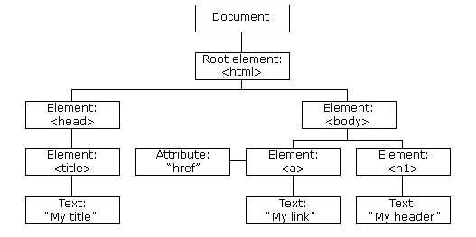
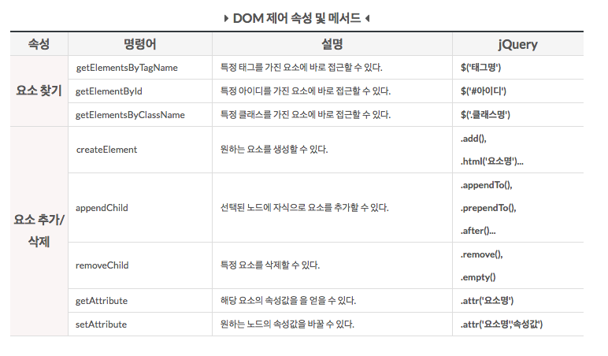

# HTML DOM(Document Object Model)
### DOM(Document Object Model)이란 무엇인가?
 - 문서 객체 모델(The Document Object Model, 이하 DOM) 은 HTML, XML 문서의 프로그래밍 interface 이다.
 - DOM은 문서의 구조화된 표현(structured representation)을 제공하며 프로그래밍 언어가 DOM 구조에 접근할 수 있는 방법을 제공하여 그들이 문서 구조, 스타일, 내용 등을 변경할 수 있게 돕는다.
 - DOM 은 구조화된 nodes와 property 와 method 를 갖고 있는 objects로 문서를 표현한다. 이들은 웹 페이지를 스크립트 또는 프로그래밍 언어들에서 사용될 수 있게 연결시켜주는 역할을 담당한다.
 - DOM 은 동일한 문서를 표현하고, 저장하고, 조작하는 방법을 제공한다.
 - DOM 은 웹 페이지의 객체 지향 표현이며, 자바스크립트와 같은 스크립팅 언어를 이용해 DOM 을 수정할 수 있다.

### DOM이 왜 필요한가?
정적인 웹페이지에 접근하여 동적으로 웹페이지를 변경하기 위한 유일한 방법은 메모리 상에 존재하는 DOM을 변경하는 것이고, 이때 필요한 것이 DOM에 접근하고 변경하는 프로퍼티와 메소드의 집합인 DOM API이다. DOM 이 없다면 자바스크립트 언어는 웹 페이지 또는 XML 페이지 및 요소들과 관련된 모델이나 개념들에 대한 정보를 갖지 못하게 된다. 문서의 모든 element - 전체 문서, 헤드, 문서 안의 table, table header, table cell 안의 text - 는 문서를 위한 document object model 의 한 부분이다. 때문에, 이러한 요소들을 DOM 과 자바스크립트와 같은 스크립팅 언어를 통해 접근하고 조작할 수 있는 것이다.  

### DOM을 어떻게 만드는가?


1. **변환:** 브라우저가 HTML의 원시 바이트를 디스크나 네트워크에서 읽어와서, 해당 파일에 대해 지정된 인코딩(예: UTF-8)에 따라 개별 문자로 변환.
2. **토큰화:** 브라우저가 문자열을 [W3C HTML5 표준](http://www.w3.org/TR/html5/)에 지정된 고유 토큰으로 변환합니다(예: '<html>', '<body>' 및 꺽쇠괄호로 묶인 기타 문자열).
3. **렉싱:** 방출된 토큰은 해당 속성 및 규칙을 정의하는 '객체'로 변환된다.
4. **DOM 생성:** 마지막으로, HTML 마크업이 여러 태그(일부 태그는 다른 태그 안에 포함되어 있음) 간의 관계를 정의하기 때문에 생성된 객체는 트리 데이터 구조 내에 연결된다.


###CSSOM(CSS Object Model)

브라우저는 단순한 페이지의 DOM을 생성하는 동안 외부 CSS 스타일시트인 style.css를 참조하는 문서의 헤드 섹션에서 링크 태그를 접한다. 페이지를 렌더링하는 데 이 리소스가 필요할 것이라고 판단한 브라우저는 이 리소스에 대한 요청을 즉시 발송하고 요청의 결과로 다음 콘텐츠가 반환된다.

```css
body { font-size: 16px }
p { font-weight: bold }
span { color: red }
p span { display: none }
img { float: right }
```

HTML과 마찬가지로, 수신된 CSS 규칙을 브라우저가 이해하고 처리할 수 있는 형식으로 변환해야 합니다. 따라서 HTML 대신 CSS에 대해 HTML 프로세스를 반복합니다.


CSS 바이트가 문자로 변환된 후 차례로 토큰과 노드로 변환되고 마지막으로 'CSS Object Model'(CSSOM)이라는 트리 구조에 링크됩니다.


### 렌더링 엔진

렌더링 엔진의 역할은 요청 받은 내용을 브라우저 화면에 표시하는 일이다. 렌더링 엔진은 HTML 및 XML 문서와 이미지를 표시할 수 있다. HTML파서는 말 그대로 HTML문서를 파싱하는데 사용되고, XML파서는 XML 형식을 따르는 SVG, MathML 등을 처리하는데 사용한다. 렌더링 엔진은 HTML 문서를 파싱하고 태그를 DOM 노드로 변환한다. 그 다음 CSS 파일과 스타일 요소를 함께 Parsing, Render Tree를 생성한다. Render Tree 생성 후에 각 노드가 화면에 표시되도록 배치를 시작하고, UI backend layer를 이용하여 배치된 노드들이 그려지게 된다.

렌더링 역할을 하는 엔진이 브라우저마다 다르기 때문에 같은 페이지가 다르게 보이는 경우가 있다.

또한, CSS에서는 아래와 같은 코드를 볼 수 있다.

```
-moz-border-radius: 2em;
-ms-border-radius: 2em;
-o-border-radius: 2em;
-webkit-border-radius: 2em;
```

렌더링 엔진의 종류로는 아래와 같다.

- Gecko - 모질라, 파이어폭스
- Blink - 구글, 오페라
- Webkit - 사파리
- Trident - 익스플로러
- EdgeHTML - 마이크로소프트 엣지


### DOM을 어떻게 만드는가

먼저, 브라우저가 DOM 및 CSSOM을 '렌더링 트리'에 결합한다. 이 트리는 페이지에 표시되는 모든 DOM 콘텐츠와 각 노드에 대한 모든 CSSOM 스타일 정보를 캡처한다.


### DOM에 어떻게 접근하는가?

##### 문서를 트리로 표현하기
HTML 문서는 중첩된 태그로 구성된 계층적인 구조를 띠는데, 이는 DOM에서 객체 트리로 표현된다. DOM 트리에는 HTML 태그나 엘리먼트를 나타내는 노드가 담긴다.
DOM 트리의 루트에 위치한 Node는 Document 객체다. DOM 트리에는 단 하나의 Document 객체만이 있다. 트리상의 노드는 대부분 Element 객체와 Text 객체, 그리고 Comment 객체에 해당한다.

~~~
  <html>
  <head>
   <title>My title</title>
  </head>
  <body>
   <a href="#">My link</a>
   <h1>My header</h1>
  </body>
  </html>
~~~



Node 객체의 childNodes 프로퍼티는 해당 노드의 자식 목록을 반환한다.
firstChild, lastChild, nextSibling, previousSibling, parentNode 프로퍼티는 노드 트리를 탐색하는 수단을 제공한다.
appendChild(), removeChild(), replaceChild(), insertBefore()와 같은 메서드를 이용하면 문서 트리에서 노드를 추가하고 제거할 수 있다.
Element 인터페이스의 getAttribute(), setAttribute(), removeAttribute() 메서드를 이용하면 엘리먼트의 속성을 대상으로 질의, 설정, 삭제할 수 있다.



### 문서 내의 엘리먼트 찾기
document 객체의 getElementsByTagName() 메서드는 태그 이름을 기준으로 노드 리스트를 반환하고 특정 타입의 HTML 엘리먼트의 리스트를 구하는 데 사용된다.

~~~
document.getElementsByTagName("body")[0];
~~~

~~~
var tables = document.getElementsByTagName("table");
console.log("The document contains " + tables + " tables.");
~~~

document 객체의 getElementById() 메서드는 id 속성을 기준으로 엘리먼트 노드를 반환하는 데 사용된다.

~~~
document.getElementById("엘리먼트-id");
~~~

document 객체의 getElementsByName() 메서드는 name 속성을 기준으로 노드 리스트를 반환하는 데 사용된다.

~~~
// Find <a name="mylink">
var link = document.getElementsByName("mylink")[0];
~~~

### 새 HTML 엘리먼트 추가
새 HTML 엘리먼트를 추가하려면 createElement()나 createTextNode() 메서드를 이용해 HTML 엘리먼트를 생성한 다음 그것을 기존 엘리먼트에 덧붙이면 된다.

~~~
<!DOCTYPE html>
<html>
<head>
<title>JavaScript Elements</title>
</head>
<body>
<div>
    <ul id='ul-1'>
        <li>list1</li>
        <li>list2</li>
        <li>list3</li>
    </ul>
</div>

<script type="text/javascript">

    var list4 = document.createElement("li");
    var node = document.createTextNode("list4");
    list4.appendChild(node);

    var element = document.getElementById("ul-1");
    element.appendChild(list4);

</script>

</body>
</html>
~~~

### 기존 HTML 엘리먼트 제거
기존 HTML 엘리먼트를 제거하려면 해당 엘리먼트 부모의 removeChild() 메서드를 이용하면 된다.

~~~
<!DOCTYPE html>
<html>
<head>
<title>JavaScript Elements</title>
</head>
<body>
<div>
    <ul id='ul-1'>
        <li>list1</li>
        <li>list2</li>
        <li>list3</li>
    </ul>
</div>

<script type="text/javascript">

    var parent = document.getElementById("ul-1");
    var li3 = document.getElementById("li-3");

    parent.removeChild(li3);

</script>

</body>
</html>
~~~

### HTML 속성 수정하기
document 엘리먼트의 속성 값을 설정하기 위해 element.setAttribute() 메서드를 사용할 수 있다.

~~~
document.getElementById("image1").setAttribute("src", "sample.jpg");
~~~

속성은 DOM 엘리먼트의 자바스크립트 프로퍼티이기도 하므로 다음과 같이 속성을 설정할 수도 있다.

~~~
document.getElementById("image1").src = "sample.jpg";
~~~

### HTML 문서 수정하기
innerHTML 프로퍼티를 이용하면 HTML 엘리먼트의 내용을 동적으로 수정할 수 있다.
HTML 엘리먼트에 대해 이 프로퍼티의 값을 조회하면 해당 엘리먼트의 자식을 나타내는 HTML 텍스트 문자열을 받게 된다.
이 프로퍼티에 값을 설정하면 브라우저에서는 HTML 파서를 호출해 프로퍼티에 지정된 문자열을 파싱해 파서가 반환하는 값으로 엘리먼트의 자식을 대체한다.

~~~
// 엘리먼트 생성
var table = document.getElementById("t1");

table.border = 1; // 속성 설정

// 이름|타입|값 헤더를 테이블에 추가
table.innerHTML = "<tr><th>Name</th><th>Type</th><th>Value</th></tr>";
~~~

## HTML DOM을 이용한 스타일 및 CSS 변경
### HTML 스타일 변경하기
자바스크립트에서 HTML 엘리먼트의 스타일을 동적으로 변경할 수 있다.
~~~
document.getElementById(id).style.property="새 스타일";
~~~

~~~
document.getElementById('image1').style.visibility="hidden";
document.getElementById("p1").style.color="green";
~~~

### HTML CSS 클래스 변경하기
동적으로 엘리먼트의 class를 설정하면 엘리먼트에 적용된 스타일을 극적으로 변경할 수 있다.

자바스크립트에서는 HTML 엘리먼트의 className 프로퍼티를 동적으로 변경할 수 있다.
~~~
document.getElementById(id).className="새 CSS";
~~~
~~~
document.getElementById('image1').className="new-css-1, new-css-2";
document.getElementById("p1").className="new-css-3, new-css-4";
~~~

## HTML DOM 이벤트와 이벤트 처리
자바스크립트 프로그램에서는 이벤트 주도 프로그래밍(event-driven programming) 모델을 사용하며, 웹 브라우저는 HTML 이벤트를 생성하고, HTML DOM은 자바스크립트가 HTML 이벤트에 반응하게 한다.

### DOM Event interface
이벤트 핸들러들(Event handlers)은 DOM에 존재하는 다양한 엘리먼트들과 관련되어 있다. 이벤트가 발생하게 되면, 이벤트 객체는 동적으로 생성되며, 이벤트를 처리할 수 있는 event listener들로 전달된다. DOM의 Event 인터페이스는 핸들러 함수로 접근할 수 있으며, 이벤트 객체는 첫 번째 인자로만 전달된다.

~~~
<html>
<head>
<title>event object parameter example</title>

<script type="text/javascript">

function showCoords(evt){
  alert(
    "clientX value: " + evt.clientX + "\n" +
    "clientY value: " + evt.clientY + "\n"
  );
}

</script>
</head>

<body onmousedown="showCoords(event)">
<p>To display the mouse coordinates click anywhere on the page.</p>
</body>
</html>
~~~

미리 정의된 event 객체 파라미터를 사용함으로서, 만약 필요하다면 다른 파라미터들과 같이 이벤트 핸들러 함수에 넘기는 것이 가능하다.

~~~
<html>
<head>
<title>event object & extra parameters example</title>

<script type="text/javascript">

var par2 = 'hello';
var par3 = 'world!';

function showCoords(evt, p2, p3){
  alert(
    "clientX value: " + evt.clientX + "\n"
    + "clientY value: " + evt.clientY + "\n"
    + "p2: " + p2 + "\n"
    + "p3: " + p3 + "\n"
  );
}

</script>
</head>

<body onmousedown="showCoords(event, par2, par3)">
<p>To display the mouse coordinates please click anywhere on the page.</p>
</body>
</html>
~~~

##### [참조]
https://developer.mozilla.org/ko/docs/Gecko_DOM_Reference/소개

http://d2.naver.com/helloworld/59361

http://codingnuri.com/javascript-tutorial/html-dom-document-object-model-overview.html

http://mygumi.tistory.com/173

https://developers.google.com/web/fundamentals/performance/critical-rendering-path/constructing-the-object-model?hl=ko