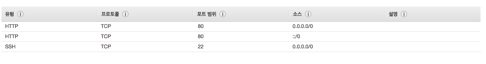
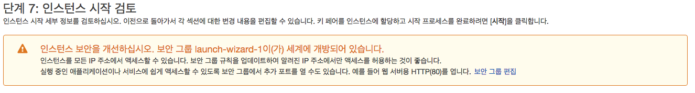
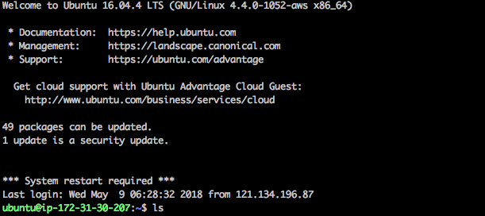
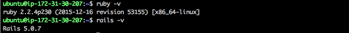

## Apache2 + Passenger로 rails 서버 배포


#### EC2 설정

ubuntu로 설정

대부분 다른 값들은 default 값으로 설정.


##### 보안 그룹 설정



ssh의 경우, 모든 포트에 열어 놓으면 아마존에서 경고창을 띄운다. 내 노트북에서만 접속할려면 내 ip를 설정하는 게 나을 것 같다.



key pair를 새로운 값으로 생성을 받은 후, .pem 키를 다운 받는다.


##### ssh 접속

인스턴스를 누르고 연결을 누르면 ssh 어떤 방식으로 연결하라는 창이 뜬다.  

Pem 파일이 있는 곳에서 ssh를 연결.



첫화면에 접속.


##### 루비 rails설치

RVM은 [https://rvm.io](https://rvm.io/)에서 설치할 수 있다.

~~~Shell
gpg --keyserver hkp://keys.gnupg.net --recv-keys 409B6B1796C275462A1703113804BB82D39DC0E3 7D2BAF1CF37B13E2069D6956105BD0E739499BDB

sudo apt-get install software-properties-common
sudo apt-add-repository -y ppa:rael-gc/rvm
sudo apt-get update
sudo apt-get install rvm
~~~

rvm이 정상적으로 깔렸는 지 버전을 확인한다.

~~~shell
rvm -v
~~~

ruby와 rails를 깐다. ruby와 rails는 왠만하면 프로젝트와 버전을 맞춰준다.

~~~shell
rvm install ruby 2.2.4
gem install rails -v 5.0.7
~~~



rails를 배포하는 데 필요한 앱들을 설치한다.

~~~shell
sudo apt-get update
sudo apt-get install apache2 curl git libmysqlclient-dev mysql-server nodejs
~~~

- mysql-server를 설치할 경우 루트 패스워드를 입력한다.
- 레일즈의 애셋 파이프라인 컴파일러는 자바스크립트 런타입을 요구하므로 Node.js를 설치해야한다.

웹브라우저에 서버IP주소를 입력하면 다음과 같은 아파치 기본화면을 볼 수 있다.


##### Passenger 설치

Nginx와 Apache는 웹서버이며, HTTP 트랜잭션을 핸들링하고 정적 파일을 서비스한다. 그러나 루비 애플리케이션 서버가 아니어서 루비 애플리케이션을 직접 돌릴 수 없다. NignX와 Apache는 Passenger와 같은 애플리케이션 서버와 함께 사용되야 한다.

~~~Shell
# PGP 키를 설치하고 APT HTTPS 지원을 추가한다.
sudo apt-key adv --keyserver hkp://keyserver.ubuntu.com:80 --recv-keys 561F9B9CAC40B2F7
sudo apt-get install -y apt-transport-https ca-certificates

# APT 저장소 추가
sudo sh -c 'echo deb https://oss-binaries.phusionpassenger.com/apt/passenger trusty main > /etc/apt/sources.list.d/passenger.list'
sudo apt-get update

# Passenger + Apache 모듈 설치
sudo apt-get install -y libapache2-mod-passenger
~~~

패신저 아파치 모듈을 enable하고(이미 되어 있을 수도 있다) 아파치를 재시작한다.

```shell
sudo a2enmod passenger
sudo apache2ctl restart
```

설치를 검증한다. 단 하나의 에러도 나면 안된다.

```shell
sudo passenger-config validate-install
```

아파치가 패신저 코어 프로세스를 시작시켰는지 확인한다. 다음 명령어로 패신저 프로세스와 아파치 프로세스를 모두 볼 수 있어야 한다.


/var/www 에 프로젝트 git을 클론한다.

```shell
cd /var/www/
sudo git clone [https://user_id@github.com/user_id/myapp.git]   
cd [myapp]                                     
```


Bundler 설치하고 실행하여, 앱 의존성`dependency`을 모두 설치한다.

```Shell
gem install bundler
bundle install
```

레일즈에서는 세션을 암호화하기 위해 특정 시크릿 키를 필요로 한다. 이것을 `config/secrets.yml`에 저장한다. 개발과 테스트용 시크릿 키는 로컬에서 자동으로 생성되지만, 프로덕션용 시크릿 키는 수동으로 생성해야 한다.

```Shell
rake secret
698b2bfc9e8e1...    # 이 줄을 복사
```

생성된 시크릿 키를 복사하여 `config/secrets.yml`의 `{{ ENV["SECRET_KEY_BASE"] }}`부분을 지우고 붙여넣는다.

마이그레이션을 적용한다.

```shell
rake db:setup RAILS_ENV="production"
```

레일즈를 precompile한다. 권한 설정을 먼저 해줘야된다.

~~~bash
rake assets:precompile RAILS_ENV=production
sudo chown ubuntu #{폴더이름}
~~~


## 아파치와 패신저 설정

```shell
passenger-config about ruby-command
passenger-config was invoked through the following Ruby interpreter:
  Command: /home/user_id/.rvm/gems/ruby-2.0.0-p643/wrappers/ruby    # 이 경로
  Version: ruby 2.0.0p643 (2015-02-25 revision 49749) [x86_64-linux]
  ...
```

`Command:` 뒤에 나온 경로는 뒤에서 사용해야 하니 별도로 복사해 놓는다.

앱의 아파치 설정 파일을 만들고 버추얼 호스트가 자신의 앱을 지정하도록 설정한다.

```Shell
sudo vi /etc/apache2/sites-available/myapp.conf
```

`myapp`은 자신의 것으로 바꾼다. 아래 설정 내용에서도 자신의 것으로 바꾼다.

```shell
<VirtualHost *:80>
   ServerName yourserver.com

   DocumentRoot /var/www/myapp/public

   PassengerRuby /home/user_id/.rvm/gems/ruby-2.0.0-p643/wrappers/ruby

   <Directory /var/www/myapp/public>
      Allow from all
      Options -MultiViews
      Require all granted
   </Directory>
</VirtualHost>
```

- `ServerName`은 자신의 서버 호스팅 이름 또는 서버IP주소를 입력해야한다.
- `DocumentRoot`는 반드시 자신의 레일즈 앱의 *public* 디렉토리를 입력해야 한다.
- `PassengerRuby`는 위에서 복사해 놓은 루비 경로 `/home/user_id/.rvm/gems/ruby-2.0.0-p643/wrappers/ruby`를 입력한다.
- `Require all granted`는 아파치 2.4 이상에서 필요하다.

더 자세한 설정은 패신저 [Configuration reference](https://www.phusionpassenger.com/library/config/apache/reference/)을 참조한다.

이제 기본 아파치 서버를 내리고 자신의 레일즈앱 myapp을 올릴 순간이다.

```
sudo a2dissite 000-default
sudo a2ensite myapp.conf
sudo apachectl restart
```

웹브라우저에 자신의 서버 주소를 입력하면 자신의 레일즈앱이 떠야 정상이다. 이 글을 쓰면서 두세번의 설치를 했는데 아래와 같은 에러가 낫다. (아래 화면은 패신저 친화적 에러 옵션을 킨 상태이고 이는 프로덕션 모드에서는 지양해야 하는 일이다. 에러가 해결되면 다시 원래대로 돌려놓아야 한다.)


##### 참조

https://nolboo.kim/blog/2015/08/18/rails-on-virtualbox-with-ubuntu-apache/

https://hcn1519.github.io/articles/2016-02/rails_passenger_nginx