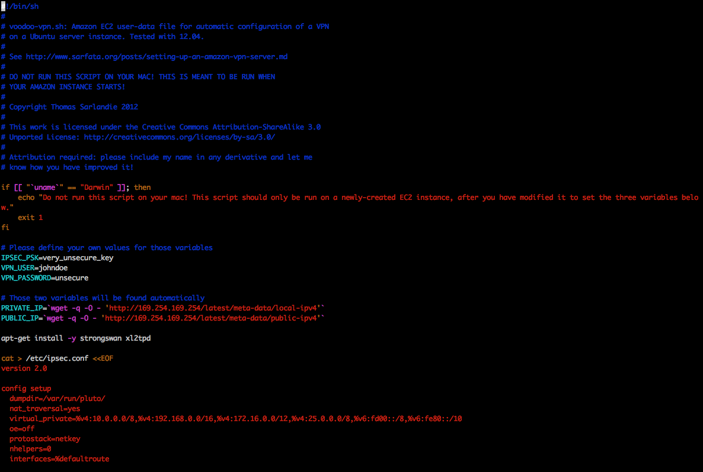
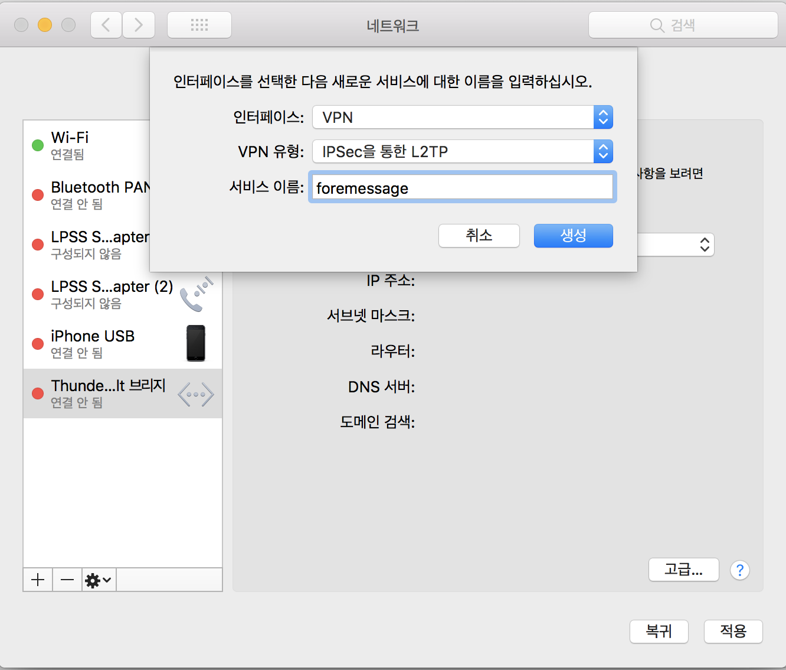
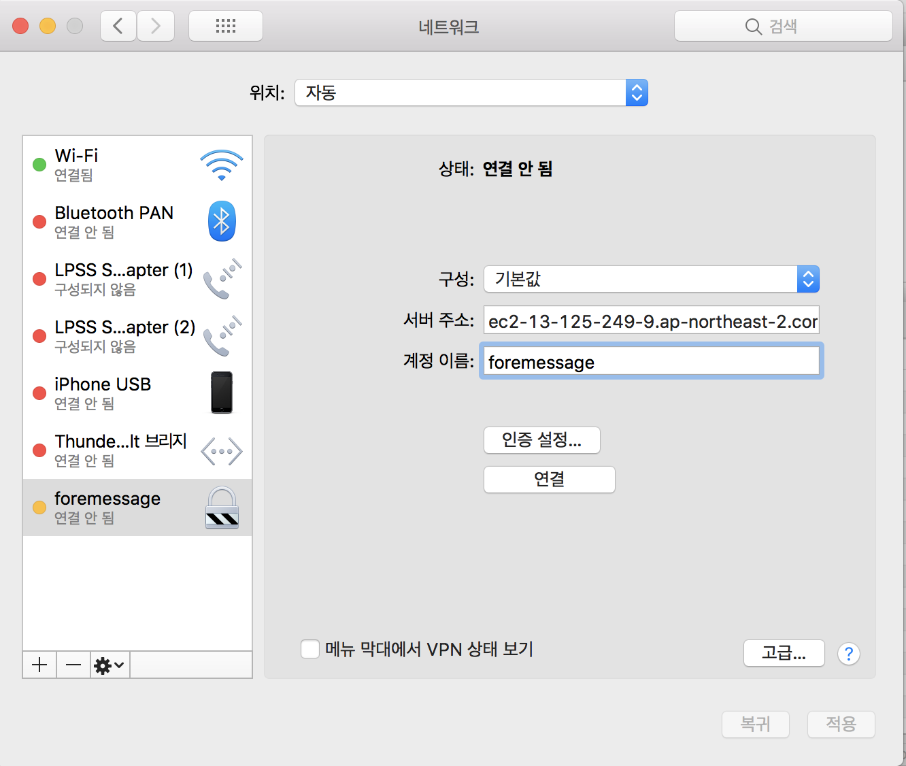
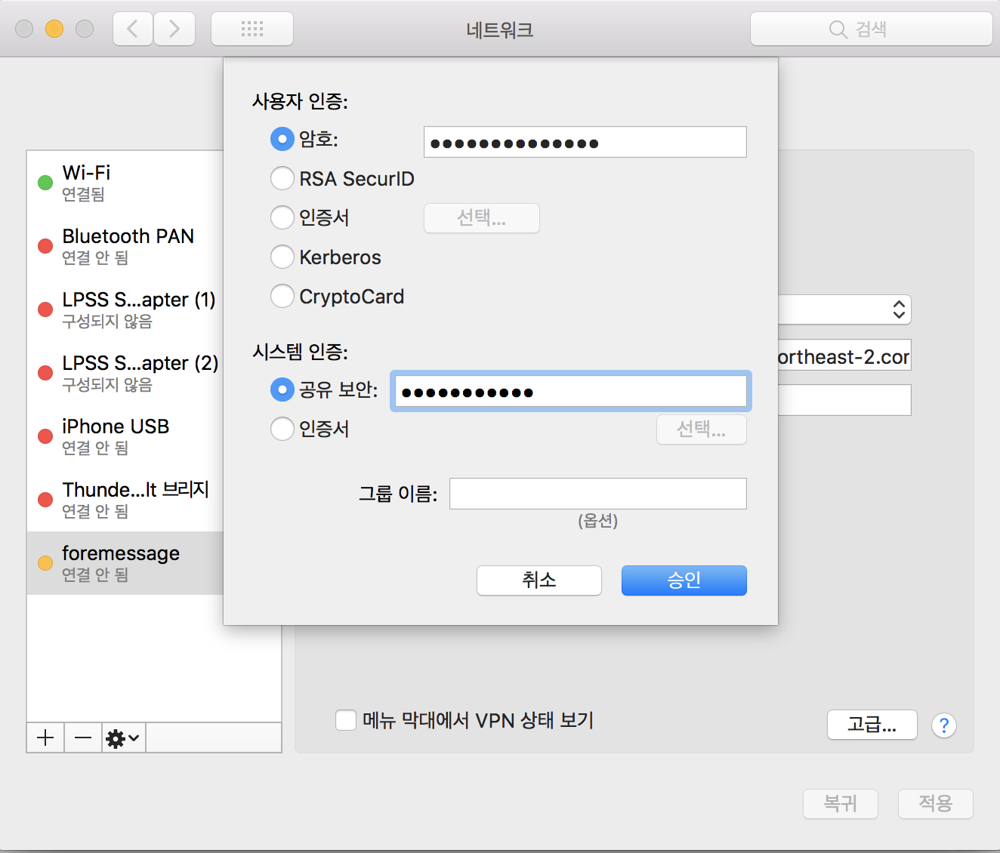

#### aws ec2를 이용한 VPN 설정하기

-----------

##### ec2 인스턴스 생성하기

##### VPN 설치

 [Voodoo Privacy Project](https://github.com/sarfata/voodooprivacy)에서 제공하는 VPN script를 이용해서 설치한다.

~~~shell
wget https://raw.githubusercontent.com/sarfata/voodooprivacy/master/voodoo-vpn.sh	
~~~

설치하고 나면 **voodoo-vpn.sh**가 생긴다.

~~~shell
sudo vi voodoo-vpn.sh	
~~~

Voodoo-vpn.sh를 열어보면,

IPSEC_PSK, VPN_USER, VPN_PASSWORD를 변경해주고 저장한다.

그다음 관리자 권한으로 설치.

~~~shell
sudo bash voodoo-vpn.sh
~~~

이러면 모든 설정이 끝난다.

##### MAC 에서 VPN 설정하기

시스템설정 > 네트워크 환경 설정 열기로 들어가서  +를 누른 후 위와 같이 설정한다.

서버 주소는 ec2의 주소, 계정 이름은 위에서 설정한 VPN_USER 값을 넣는다.

암호에는 VPN_PASSWORD 값을,  시스템 인증에 공유 보안에는 IPSEC_PSK을 집어 넣으면 된다.

고급을 누르면 VPN 연결을 통해 모든 트래픽 전송을 체크하면 모든 설정이 완료된다.

[참조]

https://www.haruair.com/blog/2518

