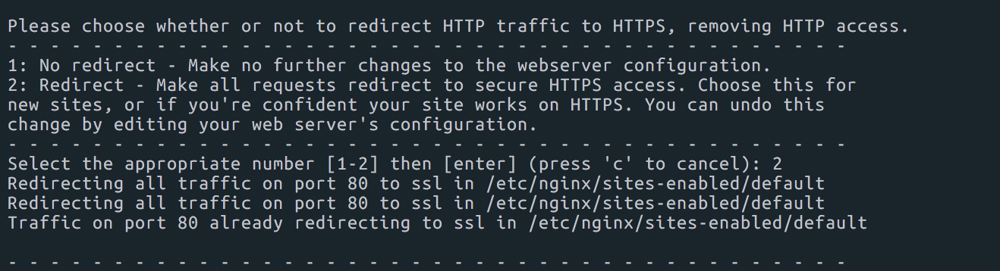

### certbot을 이용한 https 적용하기


##### Let's Encrypt

[Let’s Encrypt](https://letsencrypt.org/)는 Certificate Authority (CA). 즉, 인증기관으로 보다 쉬운 방법과 무료로 TLS/SSL 인증서를 발급해서 HTTPS 통신을 가능하게 해주는 서비스 기관이다. HTTPS를 사용하기 위해 SSL을 구매해야 하는 부분이 HTTPS 보급에 방해된다고 생각해서 SSL을 무료로 제공해서 HTTPS를 보급하기 위해 작년 말에 만들어졌다.

##### certbot

환경에 맞춰 Let’s Encrypt 인증서를 자동으로 발급/갱신해주는 봇이다. Let’s Encrypt의 인증서 발급 방식은  `인증서 요청 -> 도메인에 대한 소유권 확인 챌린지 -> 발급`과 같은 절차로 진행된다. certbot은 이러한 부분의 처리를 자동으로 수행해준다.

##### certbot 설치

```shell
sudo add-apt-repository ppa:certbot/certbot
```

apt-get에 certbot 저장소 추가.

```shell
sudo apt-get update
sudo apt-get install python-certbot-nginx
```

certbot 설치.


##### Ngnix 셋팅

```shell
sudo vim /etc/nginx/sites-available/default
```

```shell
server {
        listen 80 default_server;
        root /var/www/blog/current/public;
        passenger_enabled on;
        server_name yb94.name;
}
```

기존 파일에 server_name을 추가. domain 주소를 추가.


설정이 완료되면 ngnix 재시동.

```shell
sudo nginx -t
sudo service nginx reload
```


##### ssl 인증 획득

```shell
sudo certbot --nginx -d example.com -d www.example.com
```

도메인을 더 추가하고 싶으면, -d를 이용해서 더 추가를 하면 된다.



 모든 경우를 https로 redirect를 허용할려면 2번을 선택하면 된다.


##### 인증서 자동 갱신 확인

설정한 certbot은 90일 동안만 유효하다.  설치한 certbot은 자동으로 갱신을 이틀 단위로 해줍니다.

해당하는 갱신이 제대로 되는지는 아래 명령어를 통해서 확인 가능하다.

~~~shell
sudo certbot renew --dry-run
~~~

인증서 만료날짜를 보고 싶거나 몇일 남았는지 알 수 있는 명령어도 있다.

```shell
sudo certbot certificates
```


Ubuntu의 경우 `/etc/cron.d/`에 보면 certbot이 생성되어 있다.


[참조]

https://twpower.github.io/44-set-free-https-by-using-letsencrypt

http://riseshia.github.io/2016/10/16/certbot-let-s-encrypt.html

https://blog.outsider.ne.kr/1178