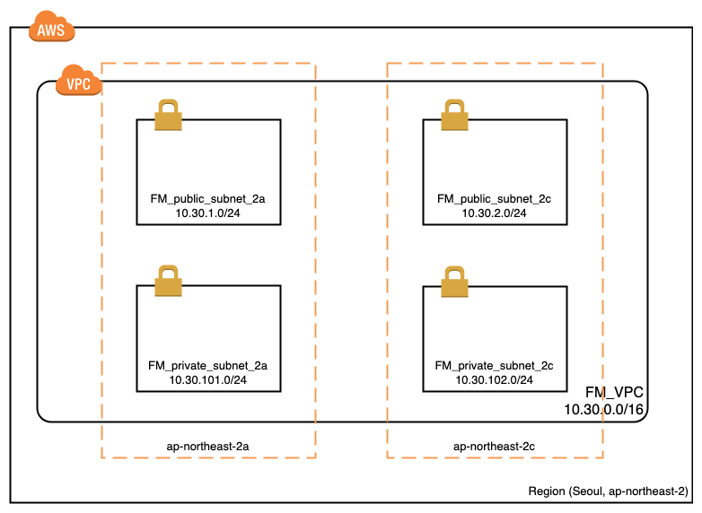
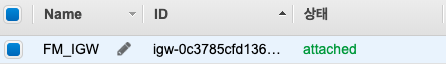
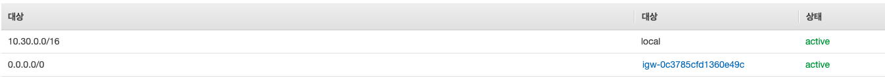
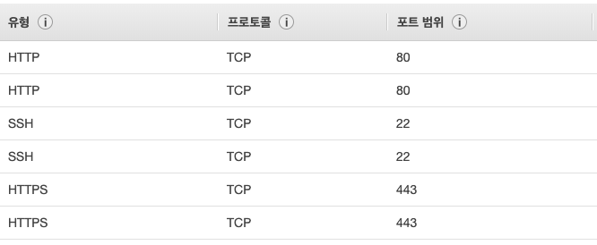
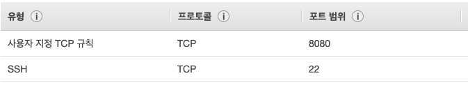
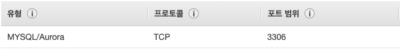
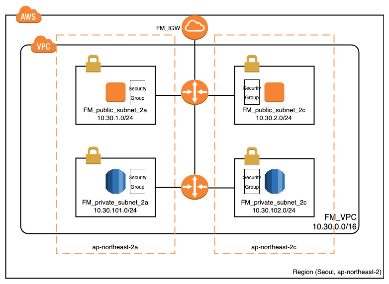

##### foremessage VPC 구축기

----------

친구들과 함께 개발에서부터 앱스토어 등록까지 실제 서비스를 배포해보고, 운영까지 목표로 앱을 개발하기 시작했다.

foremessage라는 이름으로, 기획부터 개발, 그리고 배포, 운영까지 전반적인 서비스들을 모두 구현해보는게 목표였다.

원래 IOS개발자 1명, 서버개발자 2명, 안드로이드 개발자 1명까지 완벽한 조합이였으나, 안드로이드 개발자 친구가 취업을 해버려서 아쉽게도 안드로이드는 없이 IOS만 진행하기로 했다.

배포부터 운영까지가 목표여서 인프라 담당이 필요했는데, 내가 관심이 있다보니 인프라쪽을 담당하게 되었다.

이미 이전에 rails 서버를 띄워본 경험이 있어서 서버를 띄우는데는 문제가 없지만, 이번에는 보안적인 부분을 좀 더 가져가보고 싶었다. 그래서 보안의 가장 기본이라고 할 수 있는 VPC부터 구성을 해서 해당 VPC내에 인프라를 구성하도록 할려고 한다.

VPC를 구축할 때,  https://bluese05.tistory.com/45 해당 블로그를 많이 참고했다.

##### VPC란

 VPC(Virtual Private Cloud) 서비스는 AWS 사용자가 직접 가상 네트워크 환경을 구성하는 서비스이다. 이 서비스를 이용하면 Public / Private network 환경을 사용자가 원하는대로 디자인하고 구축할 수 있게 되며, 다양한 부가 기능을 통해 VPC 환경 내 네트워크 흐름을 제어할 수 있다. 

VPC 를 디자인 하기 위해서는 먼저 Region 과 Availability Zone 에 대한 개념을 이해해야 한다. 

AWS 서비스의 가장 큰 단위는 Region이다. Region이란 AWS의 서비스가 위치한 지리적인 장소이며, 글로벌 기준으로 지역적 위치를 묶어서 관리하는 단위이다.

하나의 Region 안에는 다수의 Availability Zone 으로 구성되어 있다.Availability Zone(이하 AZ) 이란 Region 내에 실제 컴퓨팅 리소스들이 물리적으로 분리되어 있는 단위이다. 

 그렇다면, AZ간 물리적으로 떨어져 있음으로 인해 생기는 latency는 어떠할까.

 AWS 측에서는 같은 Region 내 AZ간에는 low-latency link 로 연결되어 있기 때문에 물리적으로 떨어져 있음으로 생기는 latency 에 대해 보장해준다. 

VPC를 생성할때는 반드시 Region을 지정해야 한다. 즉, VPC는 반드시 하나의 Region에 속하게 된다. 또한 VPC는 Region내 다수의 AZ를 이용해 설계가 가능하다.  만약 **VPC 를 디자인 할때 Multi AZ를 기반으로 구성한다면, 사용자는 물리적으로 다수의 데이터센터를 이용하는 것과 같은 효과를 볼 수 있다.** 

##### Subnet 이란

VPC에는 Subnet 이라는 개념이 있는데, 흔히 알고 있는 대로 IP block을 구분짓는 그 Subnet과 동일하다. 

Subnet의 특징은 반드시 하나의 AZ 에 속해야 한다는 것이다. 그렇기 때문에 VPC 내부에 다수의 Subnet 을 생성하여 각각의 AZ에 분산 배치 하면 아래와 같이 하나의 VPC에 Multi AZ 를 사용하도록 디자인 가능하다. 

foremessage VPC는 아래와 같다.

ap-northeast-2a AZ에 FM_public_subnet_2a, FM_private_2ubnet_2a를 생성,

ap-northeast-2c AZ에 FM_public_subnet_2c, FM_private_2ubnet_2c를 생성했다.

VPC CIDR는 10.30.0.0/16을 사용했고,  각 subnet CIDR은 다음과 같다.

FM_public_subnet_2a : 10.30.1.0/24

FM_public_subnet_2c : 10.30.1.0/24

FM_private_subnet_2a : 10.30.101.0/24

FM_private_subnet_2c : 10.30.102.0/24

##### public / private network 

public subnet 과 private subnet도 각각의 AZ에 분산해서 위치했고,  api 서버, jenkins 등 외부에서 접근이 가능해야 하는 서버들은 public subnet에,  RDS를 이용한 DB는 pirvate에 위치하여 외부에서 접근을 방지했다.

##### Internet Gateway

VPC 를 생성하면 모든 network가 private IP로 설정되어 있기 때문에 기본적으로 외부 통신과 단절된 상태로 생성된다.이때 외부로 통신하기 위해 Internet Gateway를 이용해 통신하도록 한다. 

Internet Gateway 생성 후, VPC에 attach한다.

routing table 생성 한 후, public subnet을 routing table에 맵핑한다.

private subnet도 routing table 생성후, 맵핑해준다.

##### Security Group

Security Group은 인스턴스에 대한 inbound 와 outbound 트래픽을 제어하는 방화벽 역할을 한다. 

##### Security Group의 특징

- Security Group은 instance 단위로 적용 시킬 수 있다. 
- 동일 Subnet 내에서 통신일 경우, ACL 규칙과 상관없이 Security Group 의 규칙을 적용 받게 된다. 
- Security Group의 규칙은 Allow 지정 방식이며, Deny 지정은 불가하다.
- 기본적으로 Inbound 트래픽의 경우 All Deny 이다. 
- Outbound 트래픽의 경우 기본적으로 All Allow 상태이며, All Allow 규칙은 삭제가 가능하고 원하는 Allow 규칙만 추가 가능하다.
- Security Group은 Stateful 하기 때문에 허용된 inbound 트래픽에 대한 응답은 outbound 규칙에 관계없이 허용된다. 

security group은 3종류로 나누었다. 

- api 서버
- Jenkins 서버
- DB서버

api 서버는 기본적인 http, https 통신을 위해 port를 열어주고, 해당 서버에 접속 할 수 있도록 VPN ip, 그리고 jenkins에서 ssh 접속을 해야되므로 jenkins ip 2개를 등록했다.

jenkins 서버의 경우, 서버에 접속할 수 있도록 VPN ip, 8080포트로 접속을 하므로 8080포트만 열어놨다.

8080 포트는 모든 ip에서 열어놓지 않고, VPN ip에서만 가능하도록 열어놨다.

DB 서버는 내부 private ip만 접속 가능하도록 하였다.

모든 기능들이 다 적용된 모습은 아래와 같다.

[출처]

 https://bluese05.tistory.com/45 

https://bluese05.tistory.com/47