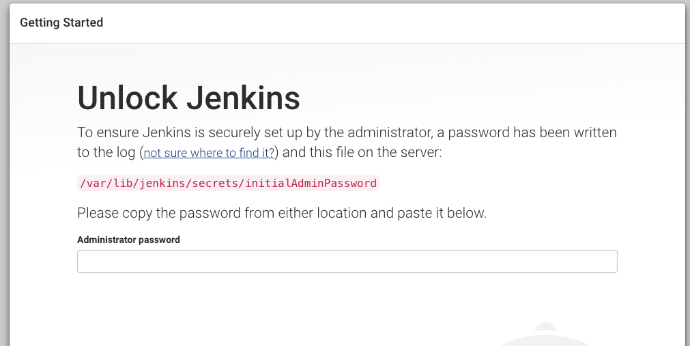
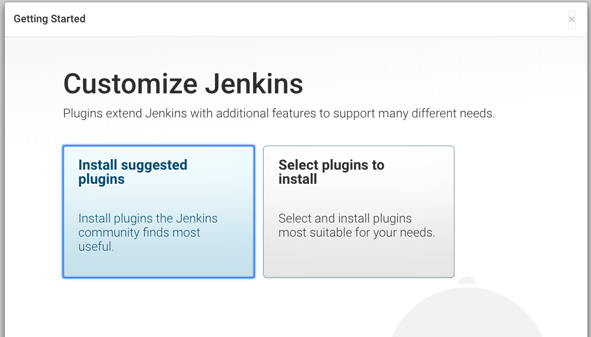
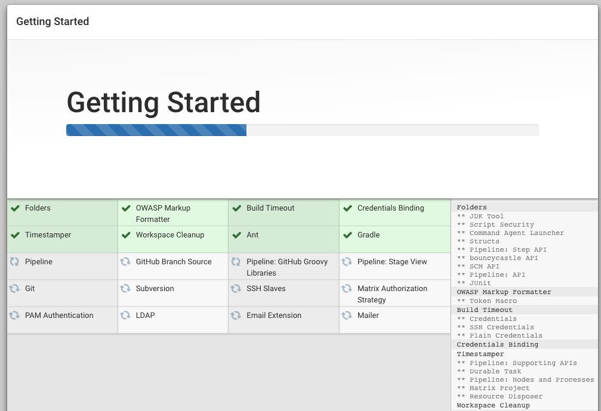

###capistrano를 이용한 jenkins 배포하기

------

##### 젠킨스 설치

환경 : ubunt 16.04

```shell
# git, openjdk-8 설치
sudo apt-get update;sudo apt-get install git openjdk-8-jdk -y

# jenkins debian package repository key 설정
sudo wget -q -O - https://pkg.jenkins.io/debian/jenkins-ci.org.key | sudo apt-key add -

# jenkins repository 주소 설정
sudo echo deb https://pkg.jenkins.io/debian-stable binary/ | sudo tee /etc/apt/sources.list.d/jenkins.list

# jenkins 설치
sudo apt-get update;
sudo apt-get install jenkins -y
```


모든 설치를 마치고 나면 웹 브라우저에서 http://<server-ip>:8080 으로 접속하여 젠킨스 구동을 확인



```shell
sudo cat /var/lib/jenkins/secrets/initialAdminPassword
```

에 나오는 비밀번호를 입력.




install suggested plugins을 선택하여 설치.




plugins 설치 진행시 실패가 발생하면, retry 버튼으로 재설치 가능.


로그인할 사용자 정보 입력.


젠킨스 설치 완료.


#####젠킨스 서버에 rbenv 설치

```shell
# ubuntu 16.04 서버에서 ruby 설치
sudo apt-get update
# ruby와 rbenv 설치를 위한 의존성 패키지 설치
sudo apt-get install autoconf bison build-essential libssl-dev libyaml-dev libreadline6- dev zlib1g-dev libncurses5-dev libffi-dev libgdbm3 libgdbm-dev apt-get install -y
# rails app 생성을 위한 nodejs, sqlite3 설치
sudo apt-get install nodejs libsqlite3-dev -y
# superuser 권한없이 rails를 사용하기 위한 rbenv 설치
git clone https://github.com/rbenv/rbenv.git ~/.rbenv
echo 'export PATH="$HOME/.rbenv/bin:$PATH"' >> ~/.bashrc echo 'eval "$(rbenv init -)"' >> ~/.bashrc
source ~/.bashrc
# rbenv install 사용을 위한 ruby-build 플러그인 설치
git clone https://github.com/rbenv/ruby-build.git ~/.rbenv/plugins/ruby-build
```


##### deploy key 등록

```shell
# github에서 생성한 repository에 연결하기 위한 ssh key 생성하기
ssh-keygen -t rsa
# 아래의 명령어로 출력된 파일 내용을 github의 blog repository에 등록 
cat ~/.ssh/id_rsa.pub
```

github repository에 settings에서 deploy keys에 등록한다.


##### 배포서버 접글을 위한 ssh key 등록

```shell`
cat ~/.ssh/id_rsa 

cat ~/.ssh/id_rsa.pub 

```

위의 두가지 파일 내용을 각각 id_rsa 파일은 App server의 동일한 경로로 복사하고 

id_rsa.pub 파일은 App server의 동일한 경로에 authorized_keys 파일 안에 추가한다.

```shell
cd;
mkdir ~/.ssh;
vim ~/.ssh/id_rsa
vim ~/.ssh/authorized_keys 
```

App server의 ssh key 보안을 위해 퍼미션을 변경한다. 

```shell
chmod 400 ~/.ssh/id_rsa 
```

파일이 잘 복사되었는지 확인한다. 

아래의 명령어로 App server의 ruby 버전이 출력되면 설정 완료 ssh <username>@<app-server-id> "ruby –v" 


##### Capistrano Gem 추가


