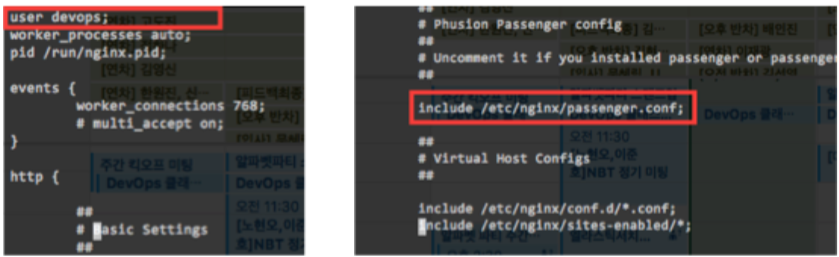
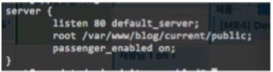

### PASSENGER + NGINX rails app server 구축하기

------

##### ubuntu 16.04 서버에서 ruby 설치

~~~shell
sudo apt-get update
~~~

##### ruby와 rbenv 설치를 위한 의존성 패키지 설치

~~~shell
sudo apt-get install autoconf bison build-essential libssl-dev libyaml-dev libreadline6-dev zlib1g-dev libncurses5-dev libffi-dev libgdbm3 libgdbm-dev -y

~~~

##### rails app 생성을 위한 nodejs, sqlite3 설치

~~~shell
sudo apt-get install nodejs libsqlite3-dev -y
~~~

##### superuser 권한없이 rails를 사용하기 위한 rbenv 설치

~~~shell
git clone https://github.com/rbenv/rbenv.git ~/.rbenv
echo 'export PATH="$HOME/.rbenv/bin:$PATH"' >> ~/.bashrc
echo 'eval "$(rbenv init -)"' >> ~/.bashrc

source ~/.bashrc
~~~

##### rbenv install 사용을 위한 ruby-build 플로그인 설치

~~~shell
git clone https://github.com/rbenv/ruby-build.git ~/.rbenv/plugins/ruby-build
~~~

##### rbenv를 이용한 ruby 설치

~~~shell
rbenv install 2.5.0
rbenv global 2.5.0

ruby -v
~~~

##### gem을 이용한 bundler와 rails 설치

~~~shell
echo "gem: --no-document" > ~/.gemrc
gem install bundler
gem install rails -v 5.1.6

rbenv rehash
rails -v
~~~

##### nginx 설치를 위한 PGP키 등록

~~~shell
sudo apt-get install dirmngr gnupg -y
sudo apt-key adv --keyserver hkp://keyserver.ubuntu.com:80 --recv-keys 561F9B9CAC40B2F7
sudo apt-get install apt-transport-https ca-certificates -y

~~~

##### Package repository 정보 등록

~~~shell
sudo sh -c 'echo deb https://oss-binaries.phusionpassenger.com/apt/passenger xenial main > /etc/apt/sources.list.d/passenger.list';sudo apt-get update
~~~

##### ngnix, passenger 설치

~~~shell
sudo apt-get install curl openssl libssl-dev nginx-extras passenger -y
~~~

Nginx configuration을 위한 Nginx 중지

~~~shell
sudo systemctl stop nginx
~~~

##### Nginx config file 내용 수정

/etc/nginx/nginx.conf 파일의 내용 중 user를 현재 서버의 로그인 사용자로 변경

user <username>; 라인의 내용 중 'www-data'사용자 이름을 현재 사용자 이름으로 변경

passenger config file의 라인을 주석을 해제

~~~shell
sudo vim /etc/nginx/nginx.conf
~~~

##### 계정에 admin group 권한 주기

~~~shell
sudo usermod -a -G admin <username>
~~~

#####/etc/nginx/passenger.conf 의 ruby 정보를 현재의 rbenv 정보로 변경

~~~
which ruby;
~~~

위의 명령어로 확인된 ruby 경로명을 passenger.conf 파일의 passenger_ruby 부분의 내용으로 교체한다.

~~~
passenger_ruby /home/<username>/.rbenv/shims/ruby;
~~~

##### /etc/nginx/site-enabled/default 내용을 아래와 같이 작성

~~~
sudo vim /etc/nginx/sites-enabled/default
~~~

(모든 default 파일 내용을 삭제 후 아래의 내용을 입력)

~~~nginx
server {
        listen 80 default_server;
        root /var/www/blog/current/public;
        passenger_enabled on;
}
~~~

##### 배포 디렉토리 권한 부여

~~~shell
sudo chown -R <username>:<username> /var/www
~~~

nginx 재시작

~~~shell
sudo systemctl restart nginx
~~~

