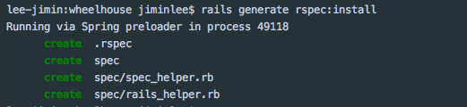
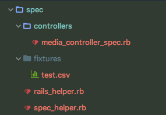

## RSPEC과 test 코드

##### rspec 이란

##### test 코드

##### 레일즈 rspec 적용

순서

1. Gemfile 세팅하기

   ~~~ruby
   group :development, :test do
     gem 'rspec-rails'             # rails 지원하는 rspec
     gem 'factory_bot_rails'       # 테스트 위한 DB의 데이타를 쉽게 생성
     gem 'faker'                   # 샘플 테스트 데이터를 쉽게 생성
   end
   ~~~

2. Rspec 세팅하기

~~~ruby
rails generate rspec:install
~~~

3. spec_helper.rb에 팩토리봇 환경 설정하기

~~~~ruby
# spec/spec_helper.rb
# spec_helper.rb에 팩토리봇 환경 설정해주기
require 'factory_bot_rails'
RSpec.configure do |config|
  # FactoryBot class 선언 없이, 메서드를 사용하기 위하여 메서드 모듈을 include함
  # 그래야 create(:user) 처럼 메서드 호출이 가능함
  config.include FactoryBot::Syntax::Methods
end
~~~~

[factory_bot 셋팅 관련 자료](http://www.rubydoc.info/gems/factory_girl/file/GETTING_STARTED.md)

4. 테스트 db만들기

~~~ruby
# db/database.yml
test:
  adapter: sqlite3
  database: db/test.sqlite3 
  pool: 5
  timeout: 5000
~~~

database.yml에서 테스트 환경을 확인한 후, sqllite db와 테이블을 만들어줍니다.

~~~ruby
bundle exec rake db:migrate RAILS_ENV=test
~~~

5. Spec 파일 만들기

spec 폴더 하위에 테스트코드를 모아놓을 폴더를 만듭니다.

controller 테스트를 짜는 경우, spec/controllers 폴더 하위에 테스트코드 파일을 추가합니다.

테스트 코드에 사용되는 고정된 테스트 파일은 [fixtures](https://relishapp.com/rspec/rspec-rails/v/3-5/docs/file-fixture) 폴더에 둡니다. 

6. factory bot 파일 만들기

factories 폴더에 필요한 팩토리 파일을 추가합니다. 팩토리봇은 factories.rb 파일이나 factories 폴더 하위에 있는 파일들을 읽어온다고 합니다.

~~~ruby
spec/factories.rb
spec/factories/*.rb
~~~

사용하기

~~~ruby
user = create(:user, email: 'jeong.minkyo@nbt.com')
~~~

테스트코드 샘플

~~~ruby
it '유저의 이메일을 반환한다' do
  user = create(:user, email: 'jun.minyoung@nbt.com')
  post :show, params: {user_id: user.id}
  result = JSON.parse(response.body)
  expect(result[:email]).to eq(user.email)
end
~~~

7. 테스트 코드 작성에 필요한 4가지

테스트 코드를 작성할 때는 크게 4가지만 알면 됩니다. 어떤 방법이 더 좋은 방법인지 고민될 때에는 [Better Spec](http://www.betterspecs.org/ko/)을 참고하세요. 

 **describe**

   테스트할 메서드 이름을 작성하는 곳입니다. 인스턴스 메서드인 경우,  #을 붙여주고요. 클래스 메서드인 경우에는 .을 붙여줍니다. 

~~~ruby
describe '#email' do
 
end
~~~

**context**

테스트할때 비슷한 맥락을 모아놓는 곳입니다. 

~~~ruby
describe '#email' do
    context '이메일 주소가 유효하지 않은 경우' do
    end
end
~~~

**it**

테스트 기대 결과를 입력하는 곳입니다.

 ~~~ruby
describe '#email' do
    context '이메일 주소가 유효하지 않은 경우' do
        it '빈 문자열을 리턴한다' do
 
        end
    end
end
 ~~~

- when > given > then 컨셉을 생각하며 테스트 코드를 작성합니다. 
- 결과값을 확인하기 까지, 여러 예외 케이스들이 발생할 수 있습니다. 이런 경우에는 중요하지 않은 함수들을 [rspec-mock](https://github.com/rspec/rspec-mocks)으로 발라주면 됩니다.
- allow, allow_any_instance_of 함수를 사용하면, 웬만한건 다 처리해낼 수 있습니다. 
- 이 함수들은 rspec-mock에서 지원하는 함수들인데, rspec-mock은 rspec-rails gem에 포함되어 있습니다. 

**before**

it을 작성할 때마다, 매번 반복되는 테스트코드들이 있을거에요.

매번 목처리를 해줘야한다거나, 매번 셋팅한 후, 전달해줘야하는 매개변수가 있다거나요.

it에서 공통으로 사용되는 것들은 before에 묶어주면, 코드를 더 깔끔하게 해주고 가독성을 높여줍니다.

before은 it이 실행될 때마다 매번 함께 호출됩니다.

여기에는 캐시 찌꺼기를 지워주거나, mocking처리를 해주거나, factory bot을 만들어줘야하는 작업 등이 포함됩니다.

~~~ruby
describe '#email' do
    context '이메일 주소가 유효하지 않은 경우' do
        before(:each) do
          @user = create(:user, email: 'sdfjlsdjflsjdf')
        end
 
 
        it '빈 문자열을 리턴한다' do
 
        end
 
        it '이메일 주소를 갱신해야한다는 푸시 메시지를 보낸다' do
 
        end
    end
end
~~~

