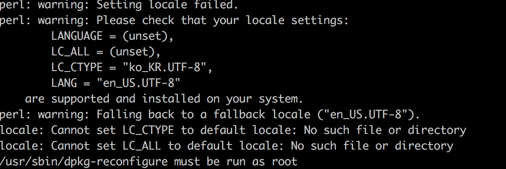
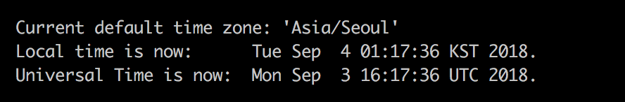

### ubuntu 서버 타임존 맞추기

--------------

젠킨스를 통해서 배포를 하다보니 배포 시간대가 오후 4시로 찍혀있다. 

실제로 배포한 시간은 새벽1시에 배포를 했었는데 오후 4시로 찍혀 있는 걸로 보아 UTC 기준으로 서버 시간이 세팅되어있는 걸 확인했다.

 실제로 api서버도 UTC 기준으로 설정이 되어있어서 이 후, 로그를 확인할 때, 시간이 맞지 않아서 확인이 어려운 부분이 있었다. 따라서 우분투 서버의 시간대를 한국시간대로 변경해서 저장하기로 했다.


##### ubuntu 서버 timezone 확인하기

```shell
date
```

**date** 명령어를 사용하면 현재 설정된 timezone을 확인할 수 있다.


UTC 기준으로 설정되어있는 걸 확인할 수 있다.

이걸 변경하기 위해서 

```shell
dpkg-reconfigure tzdata
```

명령어를 수행하면, 



다음과 같은 에러가 발생한다.

LANGUAGE와 LC_ALL이 설정되어 있지 않아서 생기는 에러이다.

해당 에러를 다음과 같이 처리한다.

```shell
export LANGUAGE=en_US.UTF-8
export LC_ALL=en_US.UTF-8
sudo locale-gen en_US.UTF-8
```

이 후, 

```shell
sudo dpkg-reconfigure tzdata
```

를 수행하면, 



변경되는 걸 확인할 수 있다.

이 후, **date** 명령어를 통해 확인해보면,


정상적으로 잘 나온다.


[참조]

https://zunonia.wordpress.com/2014/02/27/ubuntu%EC%97%90%EC%84%9C-%EC%96%B8%EC%96%B4%EC%85%8B%EC%9D%B4-%EA%B4%80%EB%A0%A8-%EC%97%90%EB%9F%AC-%EC%B2%98%EB%A6%AC%EB%B2%95/