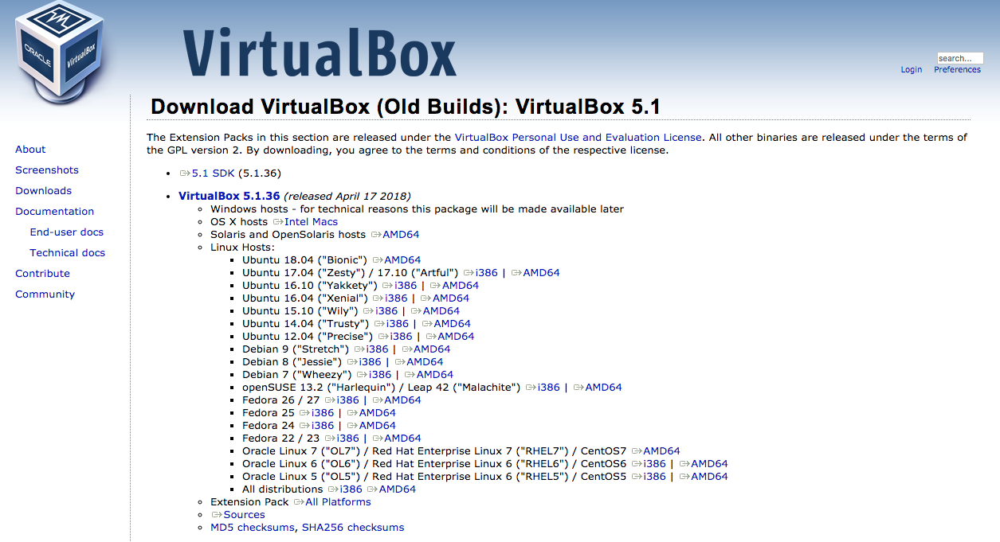
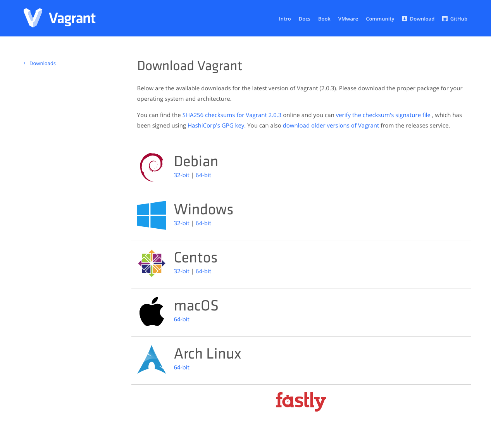
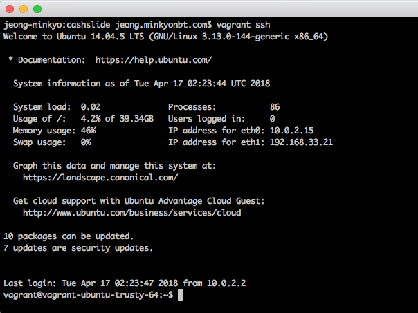
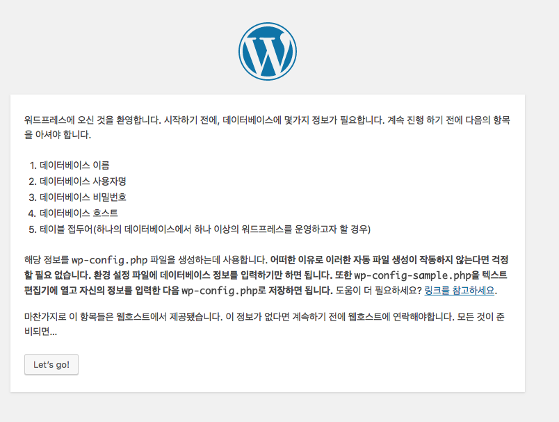
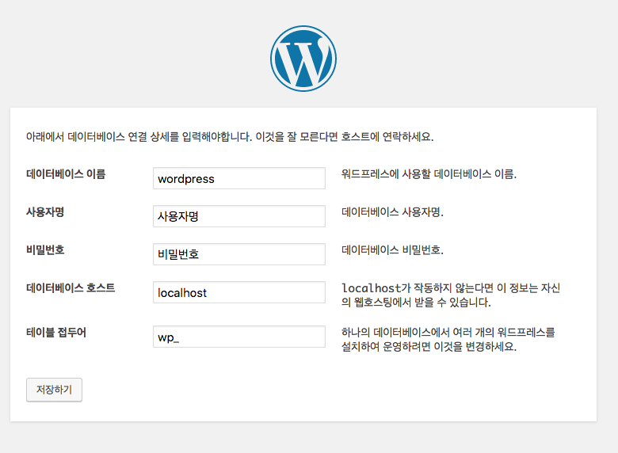
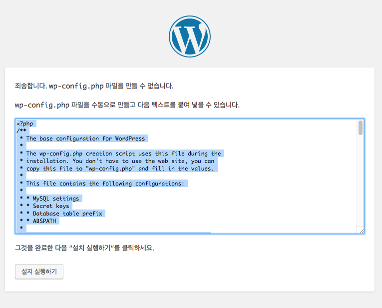
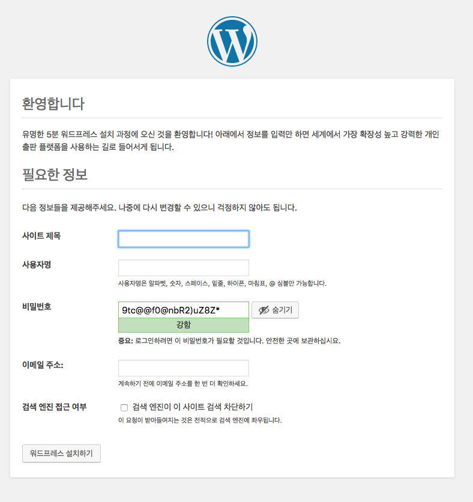
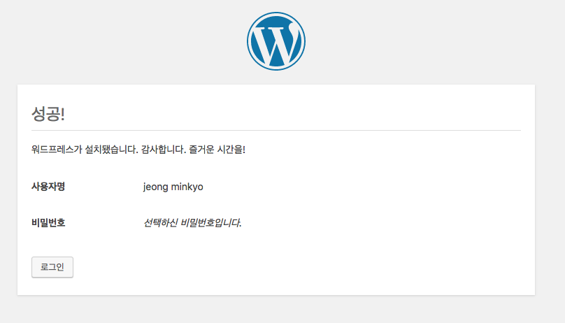

로컬에서 vagrant, virtualbox를 이용해서 서버를 띄워보고, 서버에 wordpress를 설치를 해서 nbt홈페이지, cashslide홈페이지를 관리해보는것이 목적이다.

## 서버환경 세팅

virtualBox 설치

5.2 버전은 이슈때문에 설치가 제대로 되지 않아서 5.1.36 버전으로 다운로드

 

Vagrant 설치

생성된 Vagrantfile을 수정

~~~shell
# -*- mode: ruby -*-
# vi: set ft=ruby :
# Vagrantfile API/syntax version. Don't touch unless you know what you're doing!
VAGRANTFILE_API_VERSION = "2"
Vagrant.configure(VAGRANTFILE_API_VERSION) do |config|
  config.vm.box = "precise64"
  config.vm.box_url = "http://files.vagrantup.com/precise64.box"
  config.vm.network :private_network, ip: "192.168.33.21"
  config.vm.network "forwarded_port", guest: 3309, host: 3309
  config.vm.provision :shell, :path => "install.sh"
  config.vm.synced_folder ".", "/var/www"
end
~~~

서버 ip를 192.168.33.21.

 

install.sh 파일 생성

~~~shell
sudo apt-get update
sudo debconf-set-selections <<< 'mysql-server mysql-server/root_password password root'
sudo debconf-set-selections <<< 'mysql-server mysql-server/root_password_again password root'
sudo apt-get install -y vim curl python-software-properties
sudo add-apt-repository -y ppa:ondrej/php5
sudo apt-get update
sudo apt-get install -y php5 apache2 libapache2-mod-php5 php5-curl php5-gd php5-mcrypt php5-readline mysql-server-5.5 php5-mysql git-core php5-xdebug
cat << EOF | sudo tee -a /etc/php5/mods-available/xdebug.ini
xdebug.scream=1
xdebug.cli_color=1
xdebug.show_local_vars=1
EOF
sudo a2enmod rewrite
sed -i "s/error_reporting = .*/error_reporting = E_ALL/" /etc/php5/apache2/php.ini
sed -i "s/display_errors = .*/display_errors = On/" /etc/php5/apache2/php.ini
sed -i "s/disable_functions = .*/disable_functions = /" /etc/php5/cli/php.ini
sudo service apache2 restart
curl -sS https://getcomposer.org/installer | php
sudo mv composer.phar /usr/local/bin/composer
~~~

install.sh 파일에서 mysql서버와 필요한 php, apache등 필요한 것들을 깔아줌.

 

이 후,

Vagrant up을 해주면, install.sh을 실행시켜 필요한 파일을 설치해줌.

install.sh 까지 끝나면 현재폴더와 서버의 /var/www의 폴더 싱크가 맞춰짐.

서버의 ip로 접속을하면 접속이 되어짐.

 

 

## wordpress 설치하기

 

Vagrant ssh를 이용해 서버에 접속.

/var/www 위치로 이동

wordpress를 설치

설치한 tar파일을 압축 해제

 

압춘 푼 내용을 /var/www 하위 폴더로 이동한 후, 만약 폴더명이 wordpress일 경우,

192.168.33.21/wordpress로 접속을 하면 아래와 같이 나옴.

 

mysql에 접속해서 DB를 먼저 생성한 후, 데이터베이스 이름에 생성한 DB의 이름을 쓰면 됨.

 

폴더에 쓰기 권한이 없을 경우, wp-config.php 생성을하지 못해서 생기는 이슈로, 내용을 복사한 후, 직접 wp-config.php 파일을 만들어주면 됨.

 

사용자 명이나 이메일주소로 아이디를 씀.

 

 